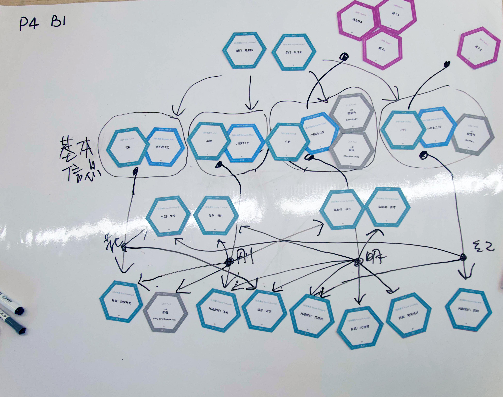

# Canvases of how people present robotic situational knowledge

This repository contains the canvas data we used in our CHI'21 paper "Patterns for Representing Knowledge Graphs to Communicate Situational Knowledge of Service Robots." We gave each participant three human-robot interaction scenarios, where the human asks the robot to communicate its situational knowledge. We then asked the participants to present the knowledge using cards on a canvas, playing the role of the robot. 

## How do I use this dataset?
Everything in this repository is open-sourced under the Apache-2.0 License. You can download the dataset [here](https://github.com/tongji-cdi/robot-knowledge-canvases/archive/v1.0.zip). 

We used this dataset to derive common patterns in presenting robotic situational knowledge. These patterns in turn contributes to designing GUIs that display a robotic knowledge graph. You can find our process of deriving the patterns in [the paper](https://arxiv.org/abs/2101.10602). We have provided the resulting NVivo file from our analysis. You can download it [here](https://github.com/tongji-cdi/robot-knowledge-canvases/releases/download/1.1/Coding_result.nvp), or see the Releases page.

You can also find the source files we used to print the cards in the `Cards PDF` folder. There are 18 files in total, containing the front and back of the cards for 9 scenarios.

## Source code in other repositories
We also made the source code of our experiment tools available. We developed a [Wizard-of-Oz testing tool](https://github.com/tongji-cdi/temi-woz-android) for the Temi robot, as well as a [knowledge graph GUI](https://github.com/tongji-cdi/temi-woz-frontend) that was designed using the patterns.

## Dataset overview
| Participant | Session 1 | Session 2 | Session 3 |
| ------------- | ------------- | ------------- | ------------- |
| P01 |  |  |  |
| P02 |  |  |  |
| P03 |  |  |  |
| P04 |  |  |  |
| P05 |  |  |  |
| P06 |  |  |  |
| P07 |  |  |  |
| P08 |  |  |  |
| P09 |  |  |  |
| P10 |  |  |  |
| P11 |  |  |  |
| P12 |  |  |  |
